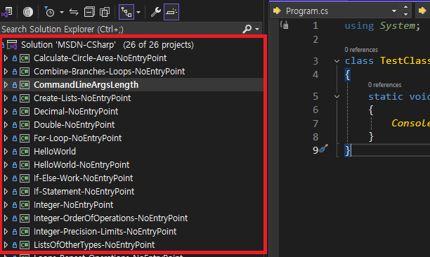
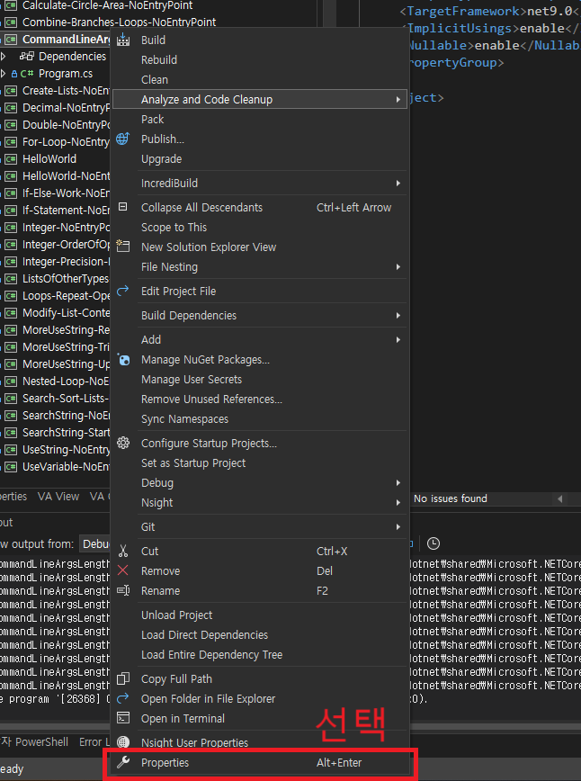
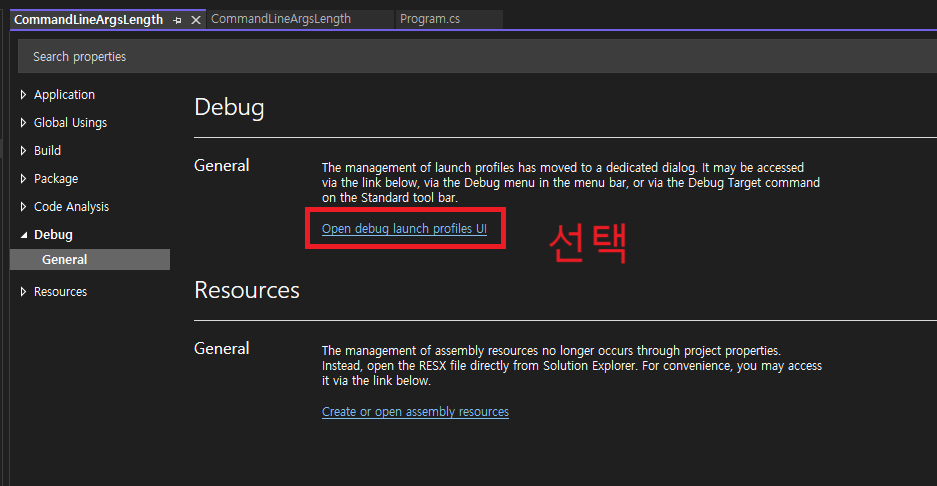
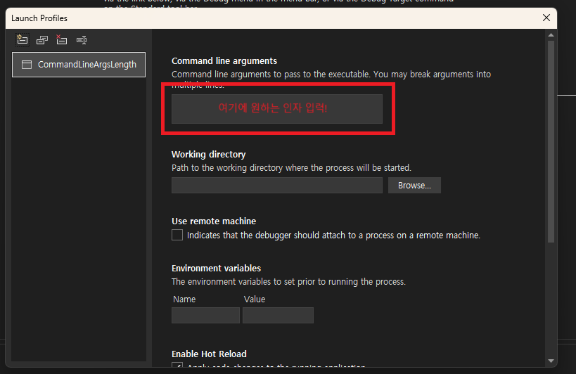
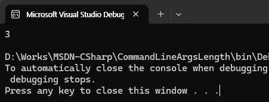

# C# 개발 시 Visual Studio에서 명령행 인자를 설정하는 방법

Visual Studio의 `Solution Explorer`에서 인자를 설정하고 싶은 프로젝트 선택

선택한 프로젝트의 Properties 선택 (Alt + Enter 입력)

이후 `Debug > General` 선택

Command line arguments 부분에 원하는 인자 설정

## 테스트

### 대상 프로젝트
- `CommandLineArgsLength`

### 입력할 명령행 인자
- `AAA BBB CCC`

### 예상되는 출력 값
- `3`

### 테스트 진행
- 출력값 확인

